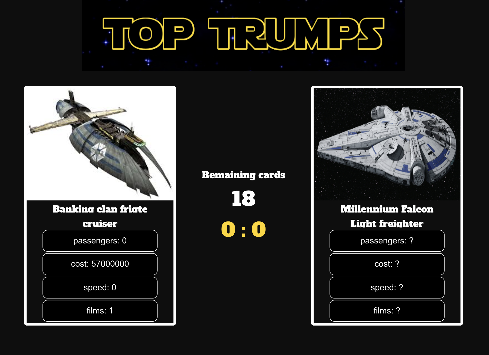

# Top Trump with starships :space_invader:
Play digital Top Trump with Starship cards. Compare attributes of your starships and win the game!

--- 

## To run the app
run `npm start` at root level. Then, open [http://localhost:3000](http://localhost:3000) to view it in the browser.

## General rules
- Cards shuffle and get distributed to each players
- Cards played by either the user or computer should not have been played before
- Category with same value to that of opponent will draw and ask you to pick differnet category to battle
- One with more score when cards run out is winner

## Further steps 
- Add tests
- Add Typescript
- Add more test
- Add differnet api to be able to play game with different cards